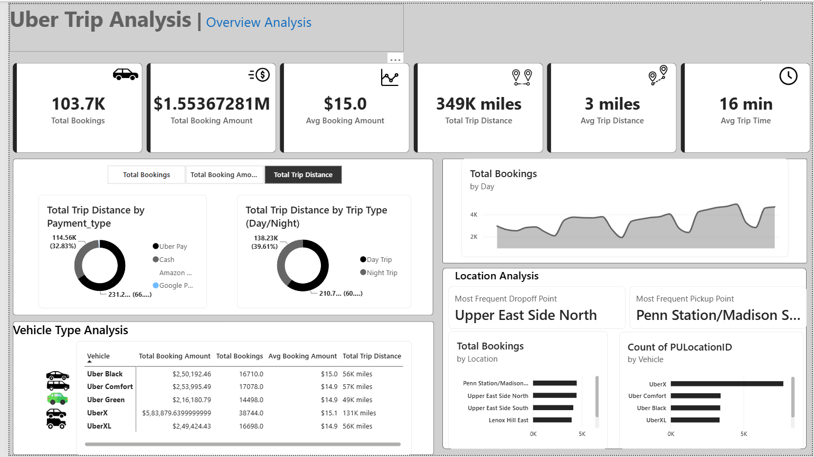

# 🚖 Power BI Uber Trip Analysis Dashboard

## 📌 Overview
This project is an interactive Power BI dashboard that analyzes Uber trip data and provides insights into bookings, revenue, trip distance, trip duration, payment methods, vehicle performance, and pickup/drop-off locations.

## 📊 Dashboard Preview

## ✨ Key Features
- Total Bookings
- Total Booking Amount
- Average Booking Amount
- Total Trip Distance
- Average Trip Distance
- Average Trip Time
- Payment Type Analysis
- Vehicle-wise Analysis
- Pickup and Drop-off Location Analysis

## 🛠️ Tools Used
- Power BI Desktop
- Microsoft Excel

## 📂 Project Files
- Uber_Trip_Analysis.pbix
- Uber Trip Details.xlsx
- Location Table.xlsx

## 👤 Author
Swain-2003
